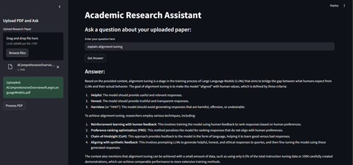

#  RAG Based Academic Research Assistant

This project is an intelligent academic assistant that leverages Retrieval-Augmented Generation (RAG) to answer user queries based on research papers in PDF format. It retrieves the most relevant chunks from the paper and generates accurate, contextual answers using the LLaMA-4 model via the GROQ API.



##  How to Run It Locally

1. **Clone this repo**  
   ```bash
   git clone https://github.com/yourusername/academic-rag-assistant.git
   cd academic-rag-assistant
2. **Install dependencies**
    ```bash
    pip install -r requirements.txt
3. **Add your GROQ API key**  
Create a .env file in the root folder:
    ```bash
    GROQ_API_KEY=your_groq_api_key
4. **Run the app**
    ```bash
    streamlit run app.py